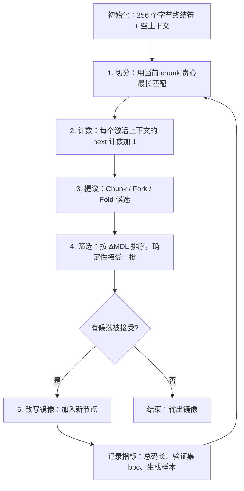

# AFRN 研究计划：可合并、可计量的离散学习系统

> 本文整理自围绕 `discusion1.md` 的讨论，是 `discusion1.md` 的修订和落地计划。
> 状态：计划阶段，尚无实验结果。文中所有数字都是目标或示意，不是实测值。

---

## 0. 出发点

1. **CPU 友好**：不依赖大规模稠密矩阵乘法。
2. **模型即数据库**：模型可以合并、分离、精确遗忘，合并以后仍然可用。
3. **离散的学习范式**：自监督预训练靠分叉（branching）和搜索，后训练用 RL。
4. **通用接口**：沿用 LLM 的成功经验，训练目标是字符串生成（next-token prediction）。字符串可以模拟代码和其他各种数据。
5. **计算量跟问题难度成正比，跟输出长度无关**：回答 1+1 应该瞬间完成；23412+123124 需要多想一会儿，但输出仍然只是一个数。

---

## 1. 核心判断

### 1.1 遗忘和泛化来自同一个原因

- 神经网络会灾难性遗忘，是因为参数共享；它能泛化，靠的也是参数共享。
- "遇错分叉、旧知识不受影响"消除了样本之间的干扰，同时也让样本之间学不到彼此的东西。只有 Fork 的系统就是一棵不断变深的决策树，也就是记忆器。
- **智能全部来自 Fold（合并、抽象）。** `topic1.md` 把 Fold 写成"后台 GC"，但它其实就是学习问题本身，研究重心应该放在这里。

### 1.2 模型是一个"程序 + 数据库"镜像

- 学出来的模型本质上是**代码**：推理是解释执行，学习是不断改写这份镜像（类似 Smalltalk image 或 Lisp machine）。
- 三种预测情况是同一条谱上的三个点：

| 情况                     | 镜像里是什么                  | 执行代价            |
| ------------------------ | ----------------------------- | ------------------- |
| 确定（记住的事实）       | KV：`input → output`          | O(1) 查找           |
| 偶然不确定（本来就随机） | 分布表：`input → counts`      | O(1) 查找，然后采样 |
| 认知不确定（没见过）     | 过程：`input → 计算 → output` | 取决于问题本身      |

事实是退化的分布，分布表是退化（完全求值后）的程序。所以只需要一个统一的概念，就是"程序"。区别只在于它被预先算到了什么程度。

### 1.3 训练程序 = 程序综合器 + 优化编译器

学习是双向的，两个方向的性质不同：

| 学习操作                                         | 是否保持语义                 | 对应概念              | 由谁把关   |
| ------------------------------------------------ | ---------------------------- | --------------------- | ---------- |
| Specialize / Chunk（程序变成表）                 | 保持：对见过的输入，行为不变 | 部分求值、tracing JIT | 频率和代价 |
| Induce / Fork / Fold（表变成程序，或把程序推广） | 不保持：改变对未见输入的行为 | 归纳式程序综合        | MDL        |

保持语义的操作可以放心自动执行；不保持语义的操作是假设，必须经过 MDL 检验，而且可以撤销。

### 1.4 宿主语言不需要能修改自己

学出来的代码是**自定义的小型 IR**，由宿主语言写的固定解释器执行。原因：

1. 每一步解释都能计数，所以代价可计量；
2. IR 节点能做 hash，所以可以内容寻址（这是合并的前提）；
3. 解释器强制预算，保证终止；
4. 描述长度能精确计算，所以 MDL 可计算；
5. 安全：学出来的代码不能调用任意系统功能。

---

## 2. 对 `topic1.md` 的修正

| 原文说法                    | 问题和修正                                                                                                                                                                    |
| --------------------------- | ----------------------------------------------------------------------------------------------------------------------------------------------------------------------------- |
| SLIDE 证明 LSH 可以替代矩阵 | SLIDE 仍然用反向传播，LSH 只用来挑出稀疏激活的神经元。引用时要准确描述。                                                                                                      |
| LSH 路由以 O(1) 成本跳转    | 哈希作用在什么表示上？固定特征会让表达能力停在 n-gram 水平。**"特征从哪来"是离散路线最大的坑**（HTM、语法归纳都卡在这里）。LSH 更适合用来**找 Fold 候选**，不适合做推理路由。 |
| 指针跳转天然契合 CPU        | 只有工作集装得进缓存时才成立。大图上的随机访问受内存延迟限制，要靠批量查找和缓存友好的布局。                                                                                  |
| Append-only，因此是 CRDT    | Fold 会合并、删除节点，不是单调操作。解法见第 3.3 节：状态和视图分离。                                                                                                        |
| 冲突转化为上下文            | 语法上合并容易，语义上合并难。合并后仍需要一个裁决机制（第 3.2 节的计数混合）。                                                                                               |
| 采用 DAG 作为底层数据结构   | 方向正确，但需要补充：**存储是 DAG，执行可以循环**，计算能力来自执行时的迭代，不来自图的深度（第 5 节）。                                                                     |

---

## 3. 形式化

### 3.1 学习目标：MDL，进一步推广为 Levin 复杂度

- next-token prediction 等价于压缩，所以自监督目标就是：

```
总码长 = L(模型结构) + Σ -log2 P(下一个符号 | 上下文)
          ↑ Fold 降低它    ↑ Fork 降低它
```

- 结构改动只有在总码长下降（ΔMDL < 0）时才接受。Fork 和 Fold 因此有了统一的判据。
- BPE 是这类离散压缩学习最简单的成功案例；Sequitur、DreamCoder/Stitch 的库抽象是它的推广。
- 加入计算代价以后，用 **Levin 复杂度** `Kt = 程序长度 + log(运行时间)`（参考 Schmidhuber 的 speed prior）作为统一目标：
    - Induce 降低程序长度；
    - Specialize（memo）降低运行时间；
    - 什么该背下来、什么该现算、什么该抽象成过程，都由同一个目标权衡。例如 `7+8=15` 高频，所以背下来；`23412+123124` 几乎不会重现，所以每次现算。

### 3.2 最小单元：模式 + 可加统计量

- 一个 unit = **匹配条件**（什么上下文会激活它）+ **计数**（下一个符号的分布）。
- 两个结构算子：`Seq`（串联）和 `Alt`（可替换类），相当于概率文法里的"串联"和"选择"。
- 预测时，把所有被激活的 unit 的分布混合起来，权重**只依赖计数**（Dirichlet/KT 边际似然，CTW 风格），跟数据到来的顺序无关。这是合并满足交换律的必要条件。

### 3.3 "模型即数据库"的三条原则

1. **可学习的状态必须是可交换幺半群**：计数、集合并满足交换律和结合律，天然就是 CRDT（G-Counter、PN-Counter、G-Set）。
    - `Merge(A, B) = compile(units_A ∪ units_B, counts_A + counts_B)`
    - `Unlearn(A, D) = compile(units_A, counts_A − counts_D)`，这是精确遗忘，不是近似。
2. **结构是派生视图，不是被修改的状态**：由统计量确定性地编译出结构（相同计数得到相同结构，平局按 hash 打破），类似 LSM-tree 的 compaction。
3. **单调性（CALM 定理）**：单调的程序不需要协调就能达到一致。学出来的代码最好是 Datalog 风格的单调规则；非单调操作放进派生视图里重新计算。

### 3.4 自适应计算：查表，查不到再计算

- System 1 是缓存命中（查表），System 2 是缓存未命中之后，在内部工作区里执行学出来的过程。
- 对应 Soar 认知架构的机制：僵局、子目标、chunking。学习就是把搜索变成查表。
- **什么时候该多想**：用计数区分两种不确定性（softmax 做不到这一点）。

| 情况       | 计数的表现                         | 动作          |
| ---------- | ---------------------------------- | ------------- |
| 认知不确定 | 总计数小，或多个激活 unit 互相矛盾 | 进入 System 2 |
| 偶然不确定 | 总计数大，但分布平坦               | 直接采样      |
| 确定       | 总计数大，分布尖锐                 | 直接输出      |

- 停止条件：计算的价值（Russell & Wefald）。RL 阶段可以直接学：答对得奖励，每一步内部计算扣少量成本。
- 每次预测的代价显式可测：`cost = 查表深度 + 内部搜索步数`。

**和 LLM 的 CoT 对比**：CoT（Chain-of-Thought，思维链）让模型先写出中间推理步骤再给答案。它同时起两个作用：增加计算步数，以及充当工作记忆。LLM 的计算量因此和输出量绑定。本架构把 CoT **内化**：

|                | LLM 的 CoT                     | AFRN                    |
| -------------- | ------------------------------ | ----------------------- |
| 中间步骤存在哪 | 输出的文字里                   | 解释器的内部工作区      |
| 每一步的代价   | 一个 token 的完整前向计算      | 解释器执行一步          |
| 计算量和输出量 | 绑定                           | 解耦                    |
| 可审计性       | 写出来的文字不一定反映真实计算 | 执行 trace 就是真实计算 |

变长计算在 GPU 上是反模式（批量内分支发散），在 CPU 上却是常态。这是离散架构结构性的切入点。

### 3.5 训练阶段划分

- **Pretraining**：在数据流上做 MDL 引导的 Fork/Fold/Chunk，统计量用计数存储。
- **RL post-training**：预测路径是显式 trace，可以沿路径做精确的信用分配（类似资格迹）。用奖励给计数加权 `counts[next] += r`，仍然是可加的，CRDT 性质不变。
- **Test-time search**：本来就是树结构，推理期分支搜索是原生能力。

---

## 4. 计算能力：分层，而不是无约束的图灵完备

### 4.1 LLM 是图灵完备的吗

| 层面                    | 结论                                                          |
| ----------------------- | ------------------------------------------------------------- |
| 单次前向传播            | 不是。固定深度电路，表达能力大致在 TC⁰（Merrill & Sabharwal） |
| 自回归 + 不限长度的 CoT | 理论上是（Pérez 等人；Merrill & Sabharwal）                   |
| 实际部署                | 严格来说是一个巨大的有限状态机（所有物理计算机都如此）        |
| 加外部工具              | 整个系统是                                                    |

要区分四个问题：**能表示什么**、**能学到什么**、**能不能可靠执行**、**代价是多少**。

### 4.2 为什么不要无约束的图灵完备

- 停机问题：学出来的代码可能不终止（靠预算解决）；
- **Rice 定理**：程序等价性不可判定，所以"合并输出等价的子树"在一般情况下做不到；
- 理想 MDL（Kolmogorov 复杂度）不可计算；
- 假设空间越大，程序综合越难。

### 4.3 分层 IR

| 层                 | 表达能力                             | 终止性                   | 对应                   |
| ------------------ | ------------------------------------ | ------------------------ | ---------------------- |
| L0 表              | 有限映射                             | 显然                     | System 1               |
| L1 全函数语言      | 结构递归 / 有界循环（`Fold` 组合子） | 保证终止，代价可静态估算 | 大多数 System 2 任务   |
| L2 通用迭代 + 燃料 | 在预算内等价于图灵完备               | 靠燃料强制终止           | 开放式搜索（以后再做） |

- **Fold 只用观察等价**：在见过的数据上行为一致就合并，把不可判定的问题换成可计算的问题。
- **学习器优先选择低层**：能用表解决的不用过程，能用结构递归的不用通用递归。

---

## 5. 存储是 DAG，执行可以循环

- **存储**指学出来的模型本身：保存在内存或磁盘上的"节点表 + 计数"。**执行**指解释器处理一个具体输入的过程。类比：源代码与程序运行。
- 纯 DAG 且没有循环机制时，单次预测的计算量上限就是图的大小，跟输入长度无关（这正是 Transformer 单次前向传播的处境）。
- **存储必须是 Merkle DAG**：节点 id = hash(自身内容 + 子节点 id)。有环就算不出 hash，内容寻址、CRDT 合并、hash-consing 式的 Fold 都会失效。
- **循环由解释器内置的组合子提供**（recursion schemes），代码图只是使用它们：

```
add(a, b) = Fold( over = zip(reverse(a), reverse(b)),
                  init = carry:0,
                  step = T )
T：(数字a, 数字b, 进位) → (结果数字, 新进位)，共 200 项的表
```

`T` 在存储里只有一份，执行时按位数被访问多次。表 `T` 靠计数就能学出来；骨架需要归纳，这是难点。骨架一旦找到，就能泛化到任意长度（Transformer 公认的弱项）。

- 以后如果需要一般递归：把相互递归的定义当成一个强连通分量整体计算 hash（参考 Unison 语言）。

---

## 6. 技术选型

### 6.1 宿主语言：OCaml

| 需求                    | OCaml 的情况                                        |
| ----------------------- | --------------------------------------------------- |
| Sum type + 穷尽模式匹配 | 语言核心特性                                        |
| 性能比 TS 好            | 编译成原生代码                                      |
| 复杂度比 Rust 低        | 有 GC，没有借用检查器                               |
| 模型快照和合并          | 标准库 `Map`/`Set` 是持久化数据结构，快照几乎零成本 |
| 验证 CRDT 定律          | QCheck 属性测试                                     |

放弃的候选：

- **Python**：类型系统弱，不适合离散建模。
- **Rust**：可行，但借用检查器会拖慢设计探索。等到要做性能验证时再迁移。
- **Zig**：1.0 之前，sum type 不能嵌套解构，缺少安全网。适合以后手工优化热路径。
- **Roc**：语言设计很契合（结构化 tag union，引用计数加原地更新），但还没有 0.1 正式版，语法仍在变动。等 1.0 以后再评估。
- **Haskell**：惰性求值导致性能难以预测。**Lean 4**：可以证明合并定律，但作为 PoC 太重。

### 6.2 编码约定（方便以后迁移到 Rust/Roc）

1. **不用对象指针**：所有节点存在 `IdMap` 里，彼此用内容 hash id 引用。
2. **状态和视图分离**：`compile : state -> structure` 是纯函数。
3. **确定性**：计数只用整数；用有序的 `Map`，不依赖哈希表的迭代顺序；平局一律按 id 排序打破。否则 `Merge(A,B) == Merge(B,A)` 的测试会时过时不过。
4. 只用 sum type 建模，不用 OCaml 的对象系统，也尽量不用 functor 的高级用法。

---

## 7. PoC 计划

### 阶段 0：环境

```sh
brew install opam
opam init -y && eval $(opam env)
cd poc
opam switch create . ocaml-base-compiler.5.3.0   # 或最新的 5.x
eval $(opam env)
opam install dune ocaml-lsp-server ocamlformat alcotest qcheck
curl -o input.txt https://raw.githubusercontent.com/karpathy/char-rnn/master/data/tinyshakespeare/input.txt
```

Zed 里安装 OCaml 扩展。

### 阶段 1：3-unit 玩具验证（只需要 L0）

语料（里面**没有** "the dog ran"）：

```
the cat sat . the dog sat . the cat ran .
```

期望学出：

```
U0: Ctx []                  counts = {the:3, cat:2, dog:1, sat:2, ran:1, .:3}
U1: Ctx [the]               counts = {cat:2, dog:1}
U2: Ctx [Alt{cat, dog}]     counts = {sat:2, ran:1}      # Fold 的产物
```

四项验证：

1. **泛化**：P(ran | the dog) 来自 U2，明显高于只靠 U0 回退时的概率。
2. **合并等价**：A 训练 `the cat sat . the cat ran .`，B 训练 `the dog sat .`，`Merge(A,B)` 和 `Merge(B,A)` 都与集中训练的结果逐位相同。
3. **精确遗忘**：从合并模型减去 B 的计数并重新编译，结果和 A 逐位相同。
4. **生成**：能采样出训练集里没有的句子 `the dog ran .`。

### 阶段 2：Tiny Shakespeare，字节级

#### 数据结构

```ocaml
type sym = int                          (* 字节终结符 0..255 *)
type id  = Digest.t                     (* 内容 hash *)

type ref_ = Term of sym | Ref of id

type node =
  | Seq of ref_ list                    (* Chunk：多字符 token *)
  | Alt of ref_ list                    (* 可替换的 token 类；排序去重 *)
  | Ctx of ref_ list                    (* 上下文模式，最近的槽位在最后；Ctx [] 是根 *)

type counts = int RefMap.t

type image = {
  code   : node IdMap.t;                (* Merkle DAG，只增不减（G-Set） *)
  counts : counts IdMap.t;              (* 每个 Ctx 节点的计数 *)
}
```

#### 训练主循环



```ocaml
let rec train ~corpus ~valid ~round ~max_rounds img =
  if round > max_rounds then img else
  let toks     = segment img corpus in               (* 1. 切分 *)
  let img      = recount img toks in                 (* 2. 计数 *)
  let cands    = propose img toks in                 (* 3. 提议 *)
  let accepted = select img cands in                 (* 4. 筛选 *)
  match accepted with
  | [] -> img                                        (* 收敛 *)
  | _  ->
    let img = apply img accepted in                  (* 5. 改写 *)
    report ~round img ~corpus ~valid;
    train ~corpus ~valid ~round:(round + 1) ~max_rounds img
```

候选类型：

| 候选               | 作用                                           | 来源                                                                   |
| ------------------ | ---------------------------------------------- | ---------------------------------------------------------------------- |
| `Chunk (a, b)`     | 高频相邻对合成新 `Seq`，学出词和短语           | 类似 BPE                                                               |
| `Fork (ctx, slot)` | 给高熵上下文左边加一个槽位，得到更具体的 `Ctx` | 记住例外                                                               |
| `Fold (a, b)`      | 后续分布和前驱分布都相似的 token 合成 `Alt`    | **泛化引擎**（在线、层次化的 Brown clustering），用 MinHash LSH 找候选 |

Fold 接受以后，下一轮的 Fork 就可以提出含 `Alt` 槽位的上下文，比如 `Ctx [Ref {king, queen}]`，在 king 上学到的东西会迁移到 queen。

码长：数据部分用 KT 估计器的负对数边际似然（只依赖计数）；模型部分按每个节点 = 种类标签 + 每个子引用 log₂(节点总数) 比特，再加上计数的编码代价估算。

#### 阶段 2 的默认设计决定（可调整）

1. **权威状态 = 语料 + 代码**：每一轮都从语料重新计数，简单且确定。代价是合并需要双方的原始语料；"不带数据合并镜像"留到后续阶段。
2. **切分只用一种**（贪心最长匹配），得到的码长是上界。
3. **混合权重**：先用简单的 PPM 式加权，效果不好再换成 CTW 那样严格的贝叶斯混合。
4. **每轮最多接受 20 个互不冲突的改动**，需要调。

### 阶段 3：加法任务（引入 L1 和 `Fold` 组合子）

- 训练数据：大量个位数加法，加上少量多位数加法的竖式过程。
- **核心图**：横轴是位数，纵轴是每次预测的内部步数。
    - 预期：个位数约为常数（查表），多位数约随位数线性增长（执行过程），输出长度始终只有一个答案。
    - 对照：LLM 每个 token 的计算量是一条水平线。
- 同时验证长度泛化：在短数上学到的骨架能否用于更长的数。

### 阶段 4 以后（每一步都有明确的失败信号）

1. **Gap 模式**（`Ctx [the, *, sat]`）：处理长距离依赖。
2. **Copy unit**（`[A B … A] → B`）：原生的"归纳头"，实现 in-context learning。
3. **RL post-training**：按奖励加权计数，沿 trace 做信用分配；学习"什么时候多想"。
4. **不带数据的镜像合并**：新节点从创建时刻开始计数。
5. **性能阶段**：热路径迁移到 Rust（或 Zig），测量缓存行为，以及与 GEMM 的每瓦效率对比。

---

## 8. 工程设计

### 8.1 目录结构

```
poc/
  dune-project
  Makefile
  src/                  # 核心库 afrn
    dune
    types.ml            # sym / id / ref_ / node / image
    segment.ml          # 切分
    count.ml            # 计数
    propose.ml          # Chunk / Fork / Fold 候选
    mdl.ml              # 码长与筛选
    predict.ml          # 预测、采样
    model_io.ml         # 模型文件读写
  bin/
    dune                # (executables (names train infer inspect) (libraries afrn))
    train.ml
    infer.ml
    inspect.ml
  test/
    dune
    test_afrn.ml        # 单元测试 + QCheck 属性测试
```

`Makefile`：

```make
build:
	dune build --profile release
	cp -f _build/default/bin/train.exe ./train
	cp -f _build/default/bin/infer.exe ./infer
	cp -f _build/default/bin/inspect.exe ./inspect

test:
	dune test

clean:
	dune clean && rm -f train infer inspect
```

### 8.2 命令行

```sh
make
./train input.txt -o model.data --rounds 50
./infer --model ./model.data --input "ROMEO:" --n 200
./inspect model.data
```

**`./train <input.txt>`**

| 选项               | 默认值       | 说明                     |
| ------------------ | ------------ | ------------------------ |
| `-o <file>`        | `model.data` | 输出模型文件             |
| `--rounds <n>`     | 50           | 最多训练轮数             |
| `--valid-frac <f>` | 0.1          | 验证集比例（取语料末尾） |
| `--per-round <k>`  | 20           | 每轮最多接受的改动数     |

每轮打印一行：`round, nodes, +chunk, +fork, +fold, model_bits, data_bits, total_bits, valid_bpc`。

**`./infer --model <file> --input <text>`**

| 选项                | 默认值 | 说明                               |
| ------------------- | ------ | ---------------------------------- |
| `--n <k>`           | 200    | 生成字符数                         |
| `--temperature <t>` | 1.0    | 采样温度                           |
| `--seed <s>`        | 42     | 随机种子（同种子同输出）           |
| `--trace`           | 关     | 打印每一步用了哪些上下文节点及权重 |
| `--stats`           | 关     | 打印每个 token 的计算步数          |

**`./inspect <model>`**：以可读形式列出学到的 `Seq`、`Alt`、`Ctx`，比如"类 #812 = {king, duke, lord}"。

所有入口都用标准库 `Arg` 解析参数，不引入额外依赖。

### 8.3 模型文件格式（自定义二进制）

```
┌──────────────────────────────────────────────┐
│ magic "AFRN"   version:u16   flags:u16       │ 头部
├──────────────────────────────────────────────┤
│ node_count:varint                            │ 节点区
│ 按拓扑序排列（子节点一定在父节点前面）：        │
│   tag:u8 (Seq|Alt|Ctx)  len:varint           │
│   refs: 每项 = Term 字节 或 前面节点的下标     │
├──────────────────────────────────────────────┤
│ ctx_count:varint                             │ 计数区
│ 每个 Ctx：entries:varint                      │
│   (next 引用:varint, count:varint) ...        │
├──────────────────────────────────────────────┤
│ checksum                                     │ 尾部
└──────────────────────────────────────────────┘
```

- **拓扑序**：DAG 保证子节点先出现，引用可以用下标（varint），不用存 16 字节 hash。
- **不存 id**：加载时重新计算，顺便做完整性校验。
- **确定性序列化**：同一个模型永远得到同样的字节。`merge A B` 和 `merge B A` 的输出文件应该逐字节相同。

---

## 9. 评估

### 9.1 基线

| 基线                                  | 作用                                                         |
| ------------------------------------- | ------------------------------------------------------------ |
| 字符级 n-gram + KT，n = 1..6          | 最低门槛：比不过说明结构学习没起作用                         |
| PPM（如 PPMd）                        | 基于计数的经典压缩器，直接竞争者                             |
| cmix / PAQ                            | CPU 上离散或半离散预测的上限参照                             |
| Infini-gram                           | "模型即数据库"的现成版本（后缀数组，只能精确匹配，不会泛化） |
| 同等 CPU 时间的小型字符级 Transformer | 参照物                                                       |

### 9.2 关键信号

1. **验证集 bpc 低于 n-gram 基线**：结构学习有效。
2. **`Alt` 节点里出现有意义的类**（人名、动词等）：Fold 在做泛化。
3. **生成样本像莎士比亚**。
4. **"主流做不到"的三项测试**：
    - 合并：前一半数据训练的 A 和后一半数据训练的 B，`Merge(A,B)` 对比全量训练；
    - 持续学习：按领域顺序训练，测量前面领域的遗忘程度；
    - 精确遗忘：删除某篇文档的贡献后，和从没见过它的模型逐位一致。
5. **自适应计算图**（阶段 3）：内部步数随问题复杂度变化，跟输出长度无关。

**失败信号**：如果 bpc 停在 n-gram 水平，说明 Fold 还没学出真正的抽象，下一步要攻克的是"离散特征学习"。

---

## 10. 主要风险和未解决的问题

1. **程序空间的搜索**：梯度在连续空间里给出方向，程序空间是离散且组合爆炸的。设想的对策：**让数据库引导代码搜索**，用计数统计作为程序综合的先验，类似 AlphaZero 用策略网络引导 MCTS（System 1 为 System 2 提供直觉）。
2. **过程 unit 从哪来**：从文本学出程序就是程序综合问题。可行路径：先从带解题步骤的数据里学出过程，再让步骤在内部执行，不输出。这相当于离散版的"CoT 内化"。
3. **离散特征学习**：Fold 的效果决定整个方向的上限。Brown clustering 历史上不如 embedding，这一步最需要创新。
4. **自知能力**：计数对"没见过"敏感，对"错误泛化"（Fold 过头）不敏感。
5. **缓存和内存延迟**：指针跳转的 CPU 优势需要实测，不能假定。
6. **工程风险**：System 2 延迟不可预测，需要硬性预算上限，防止 DoS。

---

## 11. 参考工作

- **离散和计数式预测**：PPM、CTW（Context Tree Weighting）、cmix/PAQ、Infini-gram（2024）
- **稀疏和记忆**：SLIDE（2020）、kNN-LM、Memory Layers at Scale（Meta 2024）
- **可合并的专家模型**：Branch-Train-Merge、BTX
- **纯离散路线**：Tsetlin Machine、HTM（需要分析它们为什么没能扩展到语言任务）
- **压缩和结构学习**：BPE、Sequitur、Brown clustering、MDL
- **程序综合和抽象**：DreamCoder、Stitch、ILP（Popper、Metagol）、ProbLog
- **自适应计算**：ACT（Graves 2016）、PonderNet、Universal Transformer、CALM、Mixture-of-Depths、Coconut
- **认知架构**：Soar（僵局、子目标、chunking）
- **计算理论**：Merrill & Sabharwal（Transformer 与 CoT 的表达能力）、Pérez 等人 "Attention is Turing Complete"、Levin 复杂度、Schmidhuber speed prior、Turner 全函数式编程、Rice 定理
- **分布式系统**：CRDT、CALM 定理（Hellerstein 等人）、LSM-tree
- **编程语言和系统**：tracing JIT（LuaJIT、PyPy）、Futamura 投影、Unison（内容寻址代码库）、Smalltalk image

---

## 12. 下一步

1. [ ] 安装 OCaml 工具链（第 7 节阶段 0）
2. [ ] 搭建 `poc/` dune 工程骨架，`make` 和 `dune test` 能跑通
3. [ ] 实现 `types.ml` 和 `model_io.ml`，加上序列化往返测试
4. [ ] 实现阶段 1 的 3-unit 玩具，四项验证全部通过
5. [ ] 用 QCheck 验证 CRDT 定律：交换律、结合律、`unlearn (merge a b) b = a`
6. [ ] 阶段 2：在 Tiny Shakespeare 上训练，对比 n-gram 基线
